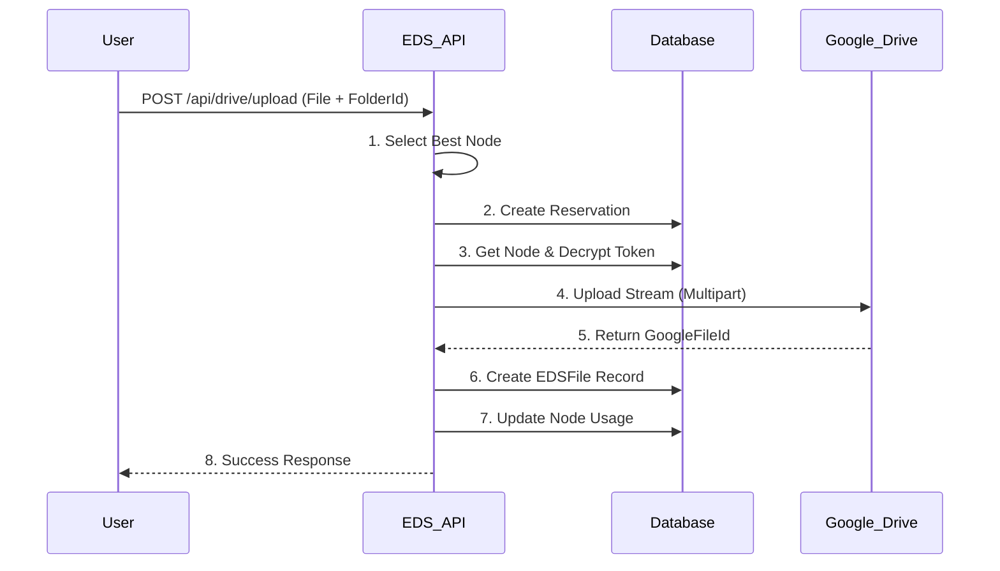

# EDS (Exstra Decentralized Storage) - Business Logic Documentation

Dokumen ini menjelaskan alur logika bisnis dan proses teknis di balik fitur-fitur EDS.

## 1. Storage Node Management (Desentralisasi Storage)

EDS menggunakan konsep **Aggregated Storage**, di mana multiple akun Google Drive (Nodes) digabungkan menjadi satu pool penyimpanan virtual yang besar.

### 1.1 Registrasi Node
1. **Inisiasi**: Admin memilih "Add New Node".
2. **OAuth Flow**: Redirect ke Google OAuth Consent Screen dengan scope `https://www.googleapis.com/auth/drive.file`.
3. **Token Exchange**: 
   - Callback menerima `authorization_code`.
   - Server menukar code dengan `access_token` dan `refresh_token`.
4. **Security**:
   - Tokens dienkripsi menggunakan **AES-256-GCM** sebelum disimpan ke database (`StorageNode` table).
   - Encryption key disimpan di environment server, tidak di database.
5. **Sync**: Server mengambil data quota (Total/Used) dari Google Drive untuk inisialisasi status node.

---

## 2. File Upload System

Sistem upload menggunakan strategi **Smart Allocation** dan **Server-Side Proxy** untuk menghindari limitasi browser (CORS).

### 2.1 Algoritma Alokasi Storage
Saat user akan mengupload file, sistem menentukan node mana yang akan digunakan:
1. **Filter**: Cari node yang `isActive` dan memiliki `free_space > file_size`.
2. **Strategy**: **Most Space Available First** (Prioritas node dengan ruang kosong terbesar).
3. **Reservation**: Membuat record `EDSReservation` untuk "booking" ketersediaan space agar tidak terjadi race condition saat multiple upload berjalan.

### 2.2 Alur Upload (Server Proxy)
Upload dilakukan via server proxy untuk keamanan token dan menghindari masalah CORS:

### 2.3 Recursive Folder Upload (Drag-and-Drop)
Fitur unggulan untuk upload struktur folder kompleks:

1. **Detection**: Menggunakan `webkitGetAsEntry()` API di browser untuk mendeteksi apakah item yang didrop adalah folder.
2. **Traversal**: Browser membaca struktur direktori secara recursive (Tree Traversal).
3. **Structure Replication**:
   - Client memetakan path lokal ke database.
   - Untuk setiap folder, Client memastikan folder tersebut ada di database EDS (`POST /api/drive/folders` path-by-path).
   - Client menyimpan mapping `Local Path` -> `EDS Folder ID`.
4. **Sequential Upload**: File diupload satu per satu dengan melampirkan `folderId` yang sesuai dari mapping structure.

---

## 3. File & Folder Management

### 3.1 Folder Navigation
- Menggunakan **Dynamic Routing** (`[[...path]]`) untuk mendukung kedalaman folder tak terbatas.
- **Breadcrumbs**: Dibangun dengan menelusuri parent secara recursive dari database.

### 3.2 Drag & Drop Move
Memindahkan file/folder antar direktori:
1. **Action**: User drag file ke folder row atau breadcrumb.
2. **API**: `PATCH /api/drive/files/[id]/move` dengan body `{ folderId: target }`.
3. **Validation**: Mencegah circular move (memindahkan folder ke dalam dirinya sendiri).

### 3.3 Deletion
Menggunakan **Soft Delete**:
- File tidak langsung dihapus dari Google Drive.
- Record database ditandai dengan `deletedAt`.
- Space belum dikembalikan sebelum permanent deletion (Trash cleaning).

---

## 4. Download System

Download menggunakan metode **Secure Streaming** agar token Google Drive tidak terekspos ke client.

1. **Request**: Client akses `/api/drive/files/[id]`.
2. **Lookup**: Server mencari metadata file untuk mendapatkan `nodeId` dan `googleFileId`.
3. **Auth Refresh**: Server mendekripsi refresh token node dan meminta access token baru ke Google (jika expired).
4. **Streaming**: 
   - Server membuka stream dari Google Drive API.
   - Stream dipipe langsung ke Response object Next.js.
   - Headers yang sesuai (`Content-Type`, `Content-Disposition`) diset agar browser mengenali sebagai file download.

---

## 5. Security & Privacy

1. **Token Protection**: Access & Refresh token selalu terenkripsi di database (AES-256).
2. **Isolated Access**: EDS hanya memiliki akses ke file yang dibuat oleh EDS sendiri (Scope: `drive.file`). Tidak bisa membaca file pribadi user di luar EDS.
3. **Middleware Upload**: File tidak pernah menyentuh disk server EDS, melainkan di-stream via memori (Buffer) langsung ke Google.
