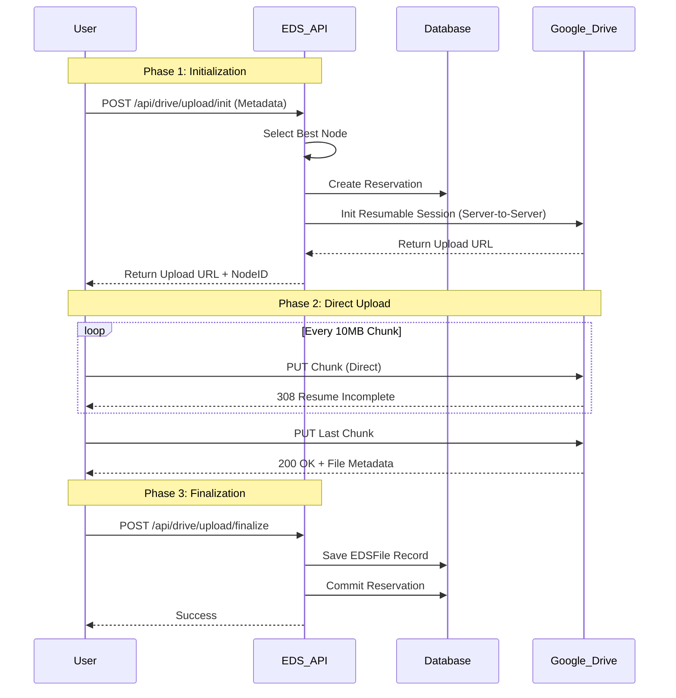
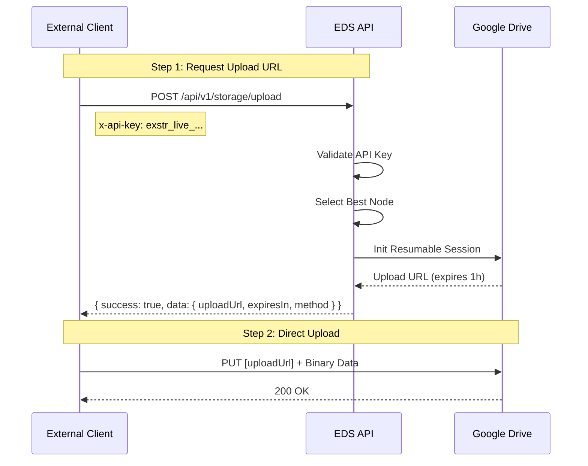

# EDS (Exstra Decentralized Storage) - Business Logic Documentation

Dokumen ini menjelaskan alur logika bisnis dan proses teknis di balik fitur-fitur EDS.

## 1. Storage Node Management (Desentralisasi Storage)

EDS menggunakan konsep **Aggregated Storage**, di mana multiple akun Google Drive (Nodes) digabungkan menjadi satu pool penyimpanan virtual yang besar.

### 1.1 Registrasi Node
1. **Inisiasi**: Admin memilih "Add New Node".
2. **OAuth Flow**: Redirect ke Google OAuth Consent Screen dengan scope `https://www.googleapis.com/auth/drive.file`.
3. **Token Exchange**: 
   - Callback menerima `authorization_code`.
   - Server menukar code dengan `access_token` dan `refresh_token`.
4. **Security**:
   - Tokens dienkripsi menggunakan **AES-256-GCM** sebelum disimpan ke database (`StorageNode` table).
   - Encryption key disimpan di environment server, tidak di database.
5. **Sync**: Server mengambil data quota (Total/Used) dari Google Drive untuk inisialisasi status node.

---

## 2. File Upload System

Sistem upload menggunakan strategi **Smart Allocation** dan **Server-Side Proxy** untuk menghindari limitasi browser (CORS).

### 2.1 Algoritma Alokasi Storage
Saat user akan mengupload file, sistem menentukan node mana yang akan digunakan:
1. **Filter**: Cari node yang `isActive` dan memiliki `free_space > file_size`.
2. **Strategy**: **Most Space Available First** (Prioritas node dengan ruang kosong terbesar).
3. **Reservation**: Membuat record `EDSReservation` untuk "booking" ketersediaan space agar tidak terjadi race condition saat multiple upload berjalan.

### 2.2 Alur Upload (Direct-to-Drive Resumable)
Sistem upload telah diupgrade menggunakan protokol **Resumable Upload** Google Drive untuk mendukung file besar (>1GB) dan bypass limitasi serverless (Vercel Timeout/Body Size).

#### Fitur Utama:
- **Chunked Upload**: File dipecah menjadi bagian-bagian kecil (10MB) di sisi client.
- **Direct Transfer**: Chunk dikirim langsung dari Browser ke Google Drive (`googleusercontent.com`), tidak membebani bandwidth server EDS.
- **Auto-Retry**: Jika koneksi putus saat upload chunk, sistem otomatis melakukan retry tanpa mengulang dari awal.
- **Support Besar**: Mendukung file hingga 5TB.

#### Technical Note: CORS Bypass Strategy
Browser secara default memblokir request PUT ke domain berbeda (`googleusercontent.com`) jika tidak ada header CORS yang sesuai. EDS mengatasi ini dengan metode **Origin Forwarding**:

1. **Server-Side Init**: Saat client request `/api/drive/upload/init`, server Next.js menangkap header `Origin` dari browser (e.g., `http://localhost:3000`).
2. **Forwarding**: Server meneruskan header `Origin` tersebut saat request Session ID ke Google Drive API.
3. **Whitelisting**: Google merespons dengan URL session yang secara spesifik mengizinkan origin tersebut (Access-Control-Allow-Origin: http://localhost:3000).
4. **Client-Side Header**: Client menggunakan `credentials: 'omit'` dan menghindari header terlarang (seperti `Content-Length` manual) untuk mencegah preflight failure.



### 2.3 Recursive Folder Upload (Drag-and-Drop)
Fitur unggulan untuk upload struktur folder kompleks:

1. **Detection**: Menggunakan `webkitGetAsEntry()` API di browser untuk mendeteksi apakah item yang didrop adalah folder.
2. **Traversal**: Browser membaca struktur direktori secara recursive (Tree Traversal).
3. **Structure Replication**:
   - Client memetakan path lokal ke database.
   - Untuk setiap folder, Client memastikan folder tersebut ada di database EDS (`POST /api/drive/folders` path-by-path).
   - Client menyimpan mapping `Local Path` -> `EDS Folder ID`.
4. **Sequential Upload**: File diupload satu per satu dengan melampirkan `folderId` yang sesuai dari mapping structure.

---

## 3. File & Folder Management

### 3.1 Folder Navigation
- Menggunakan **Dynamic Routing** (`[[...path]]`) untuk mendukung kedalaman folder tak terbatas.
- **Breadcrumbs**: Dibangun dengan menelusuri parent secara recursive dari database.

### 3.2 Drag & Drop Move
Memindahkan file/folder antar direktori:
1. **Action**: User drag file ke folder row atau breadcrumb.
2. **API**: `PATCH /api/drive/files/[id]/move` dengan body `{ folderId: target }`.
3. **Validation**: Mencegah circular move (memindahkan folder ke dalam dirinya sendiri).

### 3.3 Deletion
Menggunakan **Soft Delete**:
- File tidak langsung dihapus dari Google Drive.
- Record database ditandai dengan `deletedAt`.
- Space belum dikembalikan sebelum permanent deletion (Trash cleaning).

---

## 4. Download System

Download menggunakan metode **Secure Streaming** agar token Google Drive tidak terekspos ke client.

1. **Request**: Client akses `/api/drive/files/[id]`.
2. **Lookup**: Server mencari metadata file untuk mendapatkan `nodeId` dan `googleFileId`.
3. **Auth Refresh**: Server mendekripsi refresh token node dan meminta access token baru ke Google (jika expired).
4. **Streaming**: 
   - Server membuka stream dari Google Drive API.
   - Stream dipipe langsung ke Response object Next.js.
   - Headers yang sesuai (`Content-Type`, `Content-Disposition`) diset agar browser mengenali sebagai file download.

---

## 5. Security & Privacy

1. **Token Protection**: Access & Refresh token selalu terenkripsi di database (AES-256).
2. **Isolated Access**: EDS hanya memiliki akses ke file yang dibuat oleh EDS sendiri (Scope: `drive.file`). Tidak bisa membaca file pribadi user di luar EDS.
3. **Middleware Upload**: File tidak pernah menyentuh disk server EDS, melainkan di-stream via memori (Buffer) langsung ke Google.

---

## 6. External Developer API

EDS menyediakan API eksternal untuk akses programatik tanpa melalui UI Dashboard.

### 6.1 API Key Management

API Keys dikelola melalui Manager Dashboard (`/dashboard/api-keys`):
- **Format**: `exstr_live_[32 random hex chars]`
- **Security**: Key asli hanya ditampilkan SEKALI saat pembuatan. Database menyimpan SHA-256 hash.
- **Usage Tracking**: Field `lastUsedAt` diupdate setiap kali key digunakan.

### 6.2 Authentication

Semua endpoint `/api/v1/*` memerlukan API Key di header:

```http
x-api-key: exstr_live_a1b2c3d4e5f6...
```

### 6.3 Standardized Response

Semua response menggunakan format JSON standar:

```json
// Success
{ "success": true, "data": {...}, "error": null }

// Error
{ "success": false, "data": null, "error": "Error message" }
```

### 6.4 Upload Flow (2-Step)

Karena limitasi Vercel (4.5MB body size), external API menggunakan **2-Step Upload**:



#### Step 1: Request Upload URL

```http
POST /api/v1/storage/upload
Headers:
  x-api-key: exstr_live_...
  Content-Type: application/json

Body:
{
  "filename": "backup_db.sql",
  "mimeType": "application/sql",
  "size": 52428800,
  "folderPath": "/backups/server-a"  // Optional, auto-created if not exists
}
```

**Response:**
```json
{
  "success": true,
  "data": {
    "uploadUrl": "https://www.googleapis.com/upload/drive/v3/files?uploadType=resumable&upload_id=...",
    "expiresIn": 3600,
    "method": "PUT",
    "_meta": {
      "nodeId": "...",
      "reservationId": "...",
      "folderId": "..."
    }
  },
  "error": null
}
```

#### Step 2: Upload to Google

Client mengirim file binary langsung ke `uploadUrl` (bypass Vercel):

```http
PUT [uploadUrl]
Body: [Binary File Data]
```

### 6.5 Python Client Example

```python
import requests

API_KEY = "exstr_live_..."
BASE_URL = "https://eggisatria.dev/api/v1/storage"
FILE_PATH = "dataset.zip"

# Step 1: Request upload URL
with open(FILE_PATH, 'rb') as f:
    file_size = f.seek(0, 2)
    f.seek(0)

init_res = requests.post(
    f"{BASE_URL}/upload",
    headers={"x-api-key": API_KEY},
    json={
        "filename": "dataset.zip",
        "mimeType": "application/zip",
        "size": file_size,
        "folderPath": "/datasets"
    }
)

if not init_res.json()['success']:
    raise Exception(init_res.json()['error'])

upload_url = init_res.json()['data']['uploadUrl']

# Step 2: Upload directly to Google
with open(FILE_PATH, 'rb') as f:
    upload_res = requests.put(upload_url, data=f)
    
if upload_res.status_code == 200:
    print("Upload successful!")
else:
    print(f"Upload failed: {upload_res.text}")
```
